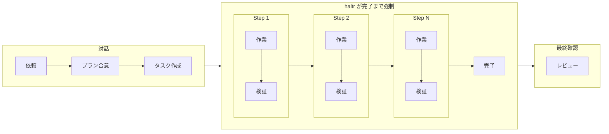

<p align="center">
  <h1 align="center">haltr</h1>
  <p align="center">
    コーディングエージェントの自律性とアウトプットの品質を向上させるツール
  </p>
  <p align="center">
    <a href="https://www.npmjs.com/package/haltr"></a>
    <a href="https://opensource.org/licenses/MIT"></a>
  </p>
  <p align="center">
    <a href="#インストール">インストール</a> · <a href="#クイックスタート">クイックスタート</a> · <a href="#コマンド一覧">コマンド</a>
  </p>
  <p align="center">
    <a href="./README.md">English</a> | 日本語
  </p>
</p>

---

## インストール

```bash
npm install -g haltr
```

## クイックスタート

```bash
# 1. hooks を登録（初回のみ）
hal setup

# 2. Claude Code を起動 — あとはエージェントが hal を使って作業
claude
```

エージェントは作業中に必要に応じて `hal` コマンドを使い、タスクを管理します。

## なぜ haltr？

現在のコーディングエージェントは、そのままでは長時間働けません。

### 忘却

- **課題**: コンテキストが長くなると、当初のゴールやルールを忘れます。モックのまま完了にする、品質基準を無視する、自分で書いたコードを自分で壊すことがあります。
- **解決策**: タスクをステップに分解し、task.yaml でゴール・状態・履歴を永続化。エージェントに記録と参照を強制します。

### 手抜き

- **課題**: 検証せずに「完了」と報告することがあります。テストを書かない、動作確認をスキップする、エラーを握りつぶしてしまいます。
- **解決策**: 各ステップに accept 条件を設定し、Sub Agent による独立検証で手抜きを防止します。

### 早期離脱

- **課題**: 途中で止まります。確認を求めて待機する、エラーで諦める、次のステップがわからず放置することがあります。
- **解決策**: Stop hook でタスク完了までブロック。pause/resume で対話モードを明示化します。

## 主な機能

- **外部記憶** — task.yaml でゴール・ステップ・履歴を永続化し、コンテキスト劣化を防止
- **品質ゲート** — accept 条件 → verify → done の流れで検証を強制
- **Stop hook** — 未完了のまま止まろうとするとブロック
- **軽量** — ディレクトリ構造の強制なし。task.yaml を任意の場所に作るだけ

## 仕組み

### ワークフロー



途中で確認が必要な場合は `hal step pause` で対話モードに切り替え可能。

### アーキテクチャ

```
エージェント（1セッション）
  │
  ├─ hal コマンド ← データ管理のみ、LLM は呼ばない
  │
  └─ task.yaml   ← 状態管理（goal, steps, history）
```

hal は判断しません。判断はエージェント、記録は hal。

## コマンド一覧

### ユーザーコマンド

| コマンド     | 説明                                 |
| ------------ | ------------------------------------ |
| `hal setup`  | hooks 登録（初回のみ）               |

### エージェントコマンド

| コマンド                                            | 説明         |
| --------------------------------------------------- | ------------ |
| `hal task create --file <name> --goal "..."`        | タスク作成   |
| `hal task edit --goal "..." --message "..."`        | タスク更新   |
| `hal status`                                        | 状態確認     |
| `hal step add --step <id> --goal "..."`             | ステップ追加 |
| `hal step start --step <id>`                        | 開始         |
| `hal step verify --step <id> --result PASS\|FAIL`   | 検証         |
| `hal step done --step <id> --result PASS\|FAIL`     | 完了         |
| `hal step pause --message "..."`                    | 対話モードへ |
| `hal step resume`                                   | 自律モードへ |

### 自動（hooks）

| コマンド            | 説明                |
| ------------------- | ------------------- |
| `hal session-start` | SessionStart hook   |
| `hal check`         | Stop hook ゲート    |

### タスクファイルの解決

全コマンドに `--file` オプションがあり、タスクファイルを明示指定できます。省略時は以下の順で自動解決:

1. セッションマッピング（`hal task create` / `hal step start` 時に自動登録）
2. カレントディレクトリの `task.yaml` or `*.task.yaml`

## 設計について

### なぜマルチエージェントにしなかったのか？

haltr v1 はオーケストレーター + ワーカー + 検証エージェントのマルチエージェント構成でした。しかし実運用で以下の問題が発生しました。

- **伝言ゲーム** — orchestrator がユーザーの意図を worker に伝える過程で情報が劣化する
- **コンテキスト損失** — step ごとに worker を re-spawn すると、暗黙知が失われる
- **オーバーヘッド** — 簡単な修正でもフルフローが走る

v2 ではメインワーカー1つに統合し、haltr はデータ管理（task.yaml + 品質ゲート）に徹する設計にしました。

v3 ではさらにスコープを絞り、ディレクトリ構造の強制を廃止。既存のプロジェクト構成と衝突しない「ツール」としての役割に集中しています。

### Bitter Lesson: 構造は最小限に

モデルは急速に進化しています。haltr が足す構造はすべて「今のモデルでは必要だが、将来のモデルでは不要になるかもしれない」という前提で設計しています。各機能について「この構造を削除したら、エージェントは自律的に動けなくなるか？」を問い、Yes のものだけを残しています。

## ライセンス

MIT
