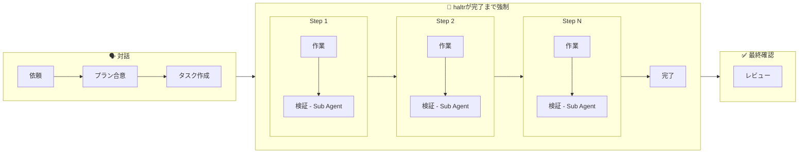

<p align="center">
  <h1 align="center">haltr</h1>
  <p align="center">
    コーディングエージェントの自律性とアウトプットの品質を向上させるハーネスツール
  </p>
  <p align="center">
    <a href="https://www.npmjs.com/package/haltr"></a>
    <a href="https://opensource.org/licenses/MIT"></a>
  </p>
  <p align="center">
    <a href="#インストール">インストール</a> · <a href="#クイックスタート">クイックスタート</a> · <a href="#コマンド一覧">コマンド</a>
  </p>
  <p align="center">
    <a href="./README.md">English</a> | 日本語
  </p>
</p>

---

## インストール

```bash
npm install -g haltr
```

## クイックスタート

```bash
# 1. 初期化（作業ディレクトリ + hooks 自動設定）
hal init

# 2. Claude Code を起動 — あとはエージェントが hal を使って作業
claude
```

エージェントは自動的に `hal` コマンドを使いながらタスクを進めます。

## なぜ haltr？

現在のコーディングエージェントは、そのままでは長時間働けません。

### 忘却

- **課題**: コンテキストが長くなると、当初のゴールやルールを忘れます。モックのまま完了にする、品質基準を無視する、自分で書いたコードを自分で壊すことがあります。
- **解決策**: タスクをステップに分解し、task.yaml + plan.md + notes.md でゴール・方針・進捗を永続化。エージェントに記録と参照を強制します。

### 手抜き

- **課題**: 検証せずに「完了」と報告することがあります。テストを書かない、動作確認をスキップする、エラーを握りつぶしてしまいます。
- **解決策**: 各ステップに accept 条件を設定し、Sub Agent による独立検証で手抜きを防止します。

### 早期離脱

- **課題**: 途中で止まります。確認を求めて待機する、エラーで諦める、次のステップがわからず放置することがあります。
- **解決策**: Stop hook でタスク完了までブロック。pause/resume で対話モードを明示化します。

## 主な機能

- **外部記憶** — task.yaml + plan.md + notes.md でコンテキスト劣化を防止
- **品質ゲート** — accept 条件 → verify → done の流れで検証を強制
- **Stop hook** — 未完了のまま止まろうとするとブロック
- **知識管理** — skills/knowledge を蓄積・参照・陳腐化検知

## 仕組み

### ワークフロー



途中で確認が必要な場合は対話モードに切り替え可能。

### アーキテクチャ

```
エージェント（1セッション）
  │
  ├─ hal コマンド ← データ管理のみ、LLM は呼ばない
  │
  ├─ task.yaml   ← 状態管理（goal, steps, history）
  ├─ plan.md     ← 方法論（人間と合意した内容）
  ├─ notes.md    ← 作業メモ（中間結果、発見）
  │
  └─ context/    ← 知識（skills + knowledge）
```

hal は判断しません。判断はエージェント、記録は hal。

## コマンド一覧

### ユーザーコマンド

| コマンド       | 説明       |
| -------------- | ---------- |
| `hal init`     | 初期化     |

### エージェントコマンド

| コマンド                                          | 説明         |
| ------------------------------------------------- | ------------ |
| `hal status`                                      | 状態確認     |
| `hal task create --goal "..." [--accept "..."]`   | タスク作成   |
| `hal step add --step <id> --goal "..."`           | ステップ追加 |
| `hal step start --step <id>`                      | 開始         |
| `hal step verify --step <id> --result PASS\|FAIL` | 検証         |
| `hal step done --step <id> --result PASS\|FAIL`   | 完了         |
| `hal step pause --message "..."`                  | 対話モードへ |
| `hal step resume`                                 | 自律モードへ |
| `hal epic create <name>`                          | エピック作成 |
| `hal context list`                                | 知識一覧     |
| `hal context show --id <id>`                      | 知識表示     |
| `hal context create --type skill\|knowledge`      | 知識作成     |
| `hal context log --id <id> --type updated`        | 知識更新記録 |

### 自動（hooks）

| コマンド            | 説明                |
| ------------------- | ------------------- |
| `hal session-start` | SessionStart hook   |
| `hal check`         | Stop hook ゲート    |

## 設計について

### なぜマルチエージェントにしなかったのか？

haltr v1 はオーケストレーター + ワーカー + 検証エージェントのマルチエージェント構成でした。しかし実運用で以下の問題が発生しました。

- **伝言ゲーム** — orchestrator がユーザーの意図を worker に伝える過程で情報が劣化する。修正のたびに orchestrator を経由するため、修正サイクルが遅い
- **コンテキスト損失** — step ごとに worker を kill → re-spawn すると、前の step で得た暗黙知が失われる。step を細かく切るほど品質が下がるという矛盾
- **オーバーヘッド** — 簡単な修正でもフルフローが走る。ユーザーが「普通に Claude Code でやった方が早い」と感じる

v2 ではメインワーカー1つに統合し、haltr はデータ管理（task.yaml + 品質ゲート + 知識管理）に徹する設計にしました。

### Spec-driven との関係性

haltr は Spec-driven development（コードを書かせる前に仕様を定義し、合意してから実装に進むアプローチ）を踏襲しつつも、よりシンプルかつ柔軟な構成を重視しました。

- **タスクの柔軟性** — 探索的な作業（EDA、プロトタイプ、検証コード）では方向が定まっていない。重い仕様では対応できない
- **方法はエージェントに委ねる** — 詳細なステップを人間が事前定義するより、ゴールと accept 条件だけ渡してエージェントに委ねた方が自律性が高まる
- **詳細な仕様は矛盾を生む** — 細かく書きすぎると矛盾の火種になる。要所を押さえた仕様の方がうまくいく

haltr では**軽量なプランファイル**（対話で詰めた合意内容）と**検証可能な accept 条件**の組み合わせを採用しています。

### Bitter Lesson: 構造は最小限に

モデルは急速に進化しています。GPT-3.5 用の複雑なオーケストレーションは GPT-4 で不要になりました。Claude 2 用のマルチステップ推論チェーンは Claude 3 で単一プロンプトに置き換わりました。

haltr が足す構造はすべて「今のモデルでは必要だが、将来のモデルでは不要になるかもしれない」という前提で設計しています。削除を前提に設計する。各機能について「この構造を削除したら、エージェントは自律的に動けなくなるか？」を問い、Yes のものだけを残しています。

### クロスコンテキスト検証（CCR）の根拠

同一セッションで自己レビューを繰り返しても、エージェントは自分のバイアスから抜け出せません。独立したコンテキストでレビューすることで、先入観のない視点から検証できます。

ただし効果は控えめであり、「銀の弾丸」ではありません。haltr では品質スタックの一層として位置づけ、タスク完了時にエージェント自身がサブエージェントとして実行する形を取っています。

## ライセンス

MIT
