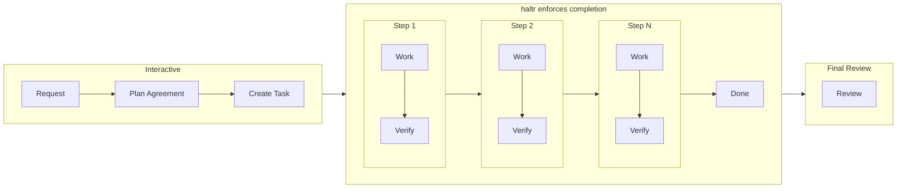

<p align="center">
  <h1 align="center">haltr</h1>
  <p align="center">
    A tool to improve coding agent autonomy and output quality
  </p>
  <p align="center">
    <a href="https://www.npmjs.com/package/haltr"></a>
    <a href="https://opensource.org/licenses/MIT"></a>
  </p>
  <p align="center">
    <a href="#installation">Installation</a> · <a href="#quick-start">Quick Start</a> · <a href="#commands">Commands</a>
  </p>
</p>

---

## Installation

```bash
npm install -g haltr
```

## Quick Start

```bash
# 1. Register hooks (first time only)
hal setup

# 2. Start Claude Code — the agent will use hal to manage tasks
claude
```

The agent uses `hal` commands as needed during work to manage tasks.

## Why haltr?

Current coding agents cannot work for extended periods without issues.

### Forgetting

- **Problem**: As context grows, agents forget initial goals and rules. They may leave mocks in place, ignore quality standards, or break their own code.
- **Solution**: Decompose tasks into steps, persist goals/state/history in task.yaml. Force agents to record and reference.

### Cutting Corners

- **Problem**: Agents sometimes report "done" without verification. They skip tests, skip manual checks, or swallow errors.
- **Solution**: Set accept criteria for each step, with independent verification by Sub Agent to prevent shortcuts.

### Early Exit

- **Problem**: Agents stop midway. They wait for confirmation, give up on errors, or abandon work when unsure of next steps.
- **Solution**: Stop hook blocks until task completion. pause/resume explicitly switches to interactive mode.

## Key Features

- **External Memory** — task.yaml persists goals, steps, and history to prevent context degradation
- **Quality Gates** — accept criteria → verify → done flow enforces verification
- **Stop Hook** — Blocks attempts to stop before completion
- **Lightweight** — No directory structure enforcement. Just create task.yaml anywhere

## How It Works

### Workflow



Use `hal step pause` to switch to interactive mode when confirmation is needed.

### Architecture

```
Agent (1 session)
  │
  ├─ hal command ← Data management only, no LLM calls
  │
  └─ task.yaml   ← State management (goal, steps, history)
```

hal does not make decisions. The agent decides, hal records.

## Commands

### User Commands

| Command      | Description                    |
| ------------ | ------------------------------ |
| `hal setup`  | Register hooks (first time only) |

### Agent Commands

| Command                                             | Description    |
| --------------------------------------------------- | -------------- |
| `hal task create --file <name> --goal "..."`        | Create task    |
| `hal task edit --goal "..." --message "..."`        | Update task    |
| `hal status`                                        | Check status   |
| `hal step add --step <id> --goal "..."`             | Add step       |
| `hal step start --step <id>`                        | Start step     |
| `hal step verify --step <id> --result PASS\|FAIL`   | Verify step    |
| `hal step done --step <id> --result PASS\|FAIL`     | Complete step  |
| `hal step pause --message "..."`                    | Switch to interactive |
| `hal step resume`                                   | Switch to autonomous  |

### Automatic (hooks)

| Command             | Description         |
| ------------------- | ------------------- |
| `hal session-start` | SessionStart hook   |
| `hal check`         | Stop hook gate      |

### Task File Resolution

All commands accept the `--file` option to explicitly specify the task file. When omitted, resolution follows this order:

1. Session mapping (auto-registered on `hal task create` / `hal step start`)
2. `task.yaml` or `*.task.yaml` in current directory

## Design Notes

### Why Not Multi-Agent?

haltr v1 used a multi-agent architecture with orchestrator + worker + verification agents. However, real-world usage revealed issues:

- **Telephone Game** — Information degrades as the orchestrator relays user intent to workers
- **Context Loss** — Re-spawning workers per step loses implicit knowledge
- **Overhead** — Full flow runs even for simple fixes

v2 consolidated to a single main worker, with haltr focusing on data management (task.yaml + quality gates).

v3 further narrowed the scope, removing directory structure enforcement. It focuses on being a "tool" that doesn't conflict with existing project structures.

### Bitter Lesson: Minimize Structure

Models are evolving rapidly. All structure haltr adds is designed with the assumption that "it's needed for current models but may become unnecessary for future models." For each feature, we ask "If we remove this structure, will the agent fail to work autonomously?" Only features with a "Yes" answer remain.

## License

MIT
